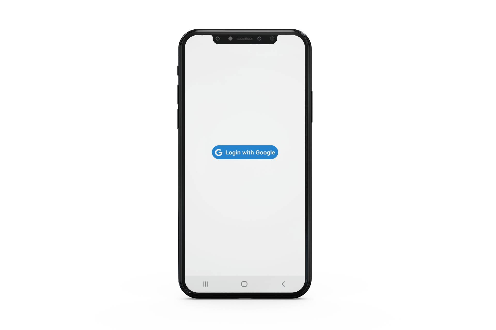
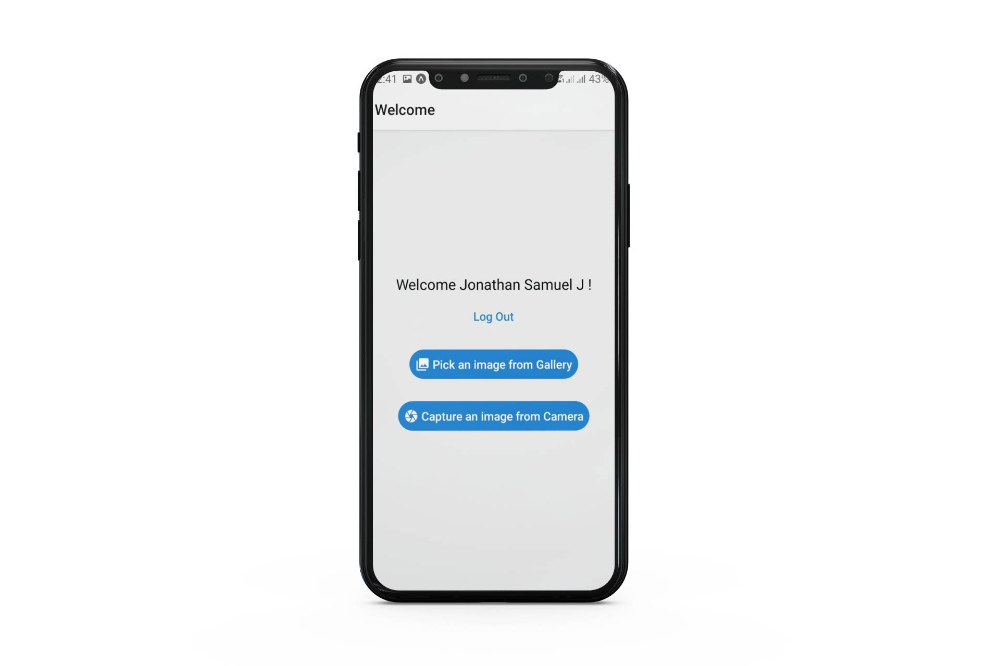
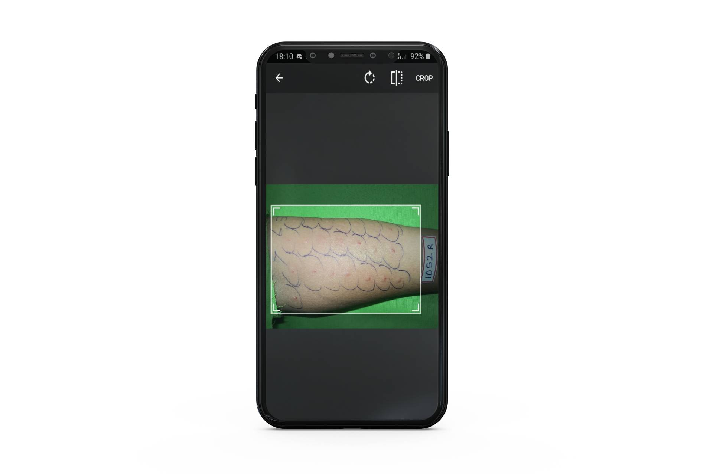
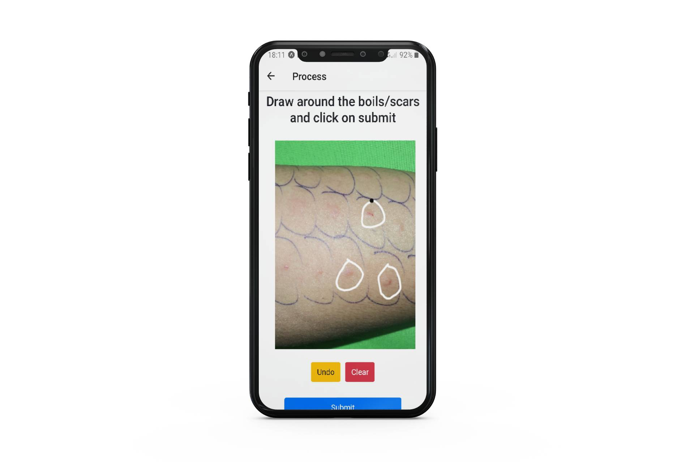
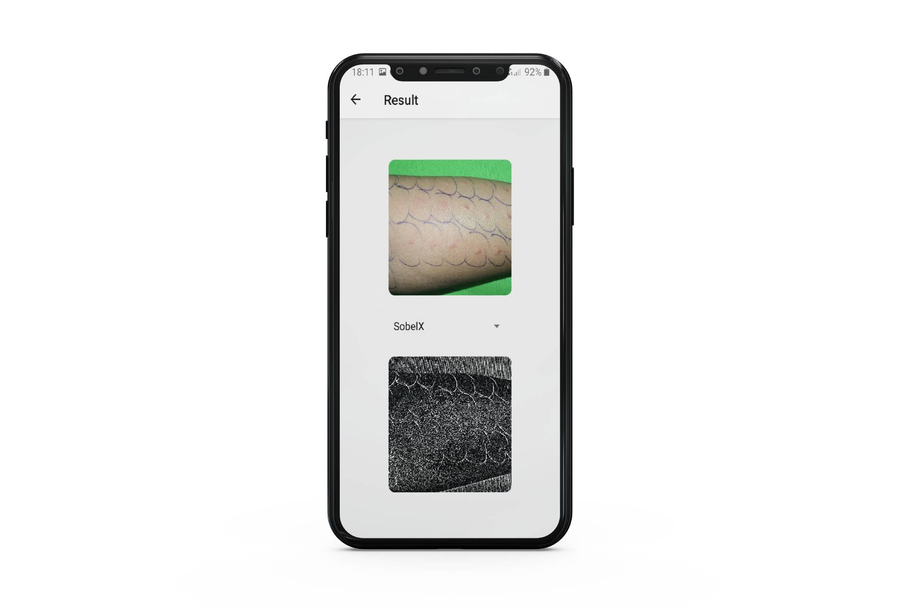

# Image Processing Application for Medical Systems

## :brain: Idea

Developing a Application to help patients take/upload pictures of boils/scars right with their smartphones and immediatly get processed images to help in further medical diagnosis.

## :triangular_ruler: Architecture

- Backendend : NodeJS for main functions and Flask as a microservice for doing image processing

- Frontend : React Native ([_Click to view the Repo_](https://github.com/shubh128/ProjectFrontEnd))

## :iphone: Screenshots

### Login Page

### Home Page

### Crop Page

### Hand Selection Page

### Result Page

## :fist_right: :fist_left: Team Members

- [Shubh Deep](https://github.com/shubh128)
- [Jonathan Samuel](https://github.com/Joe2k)
